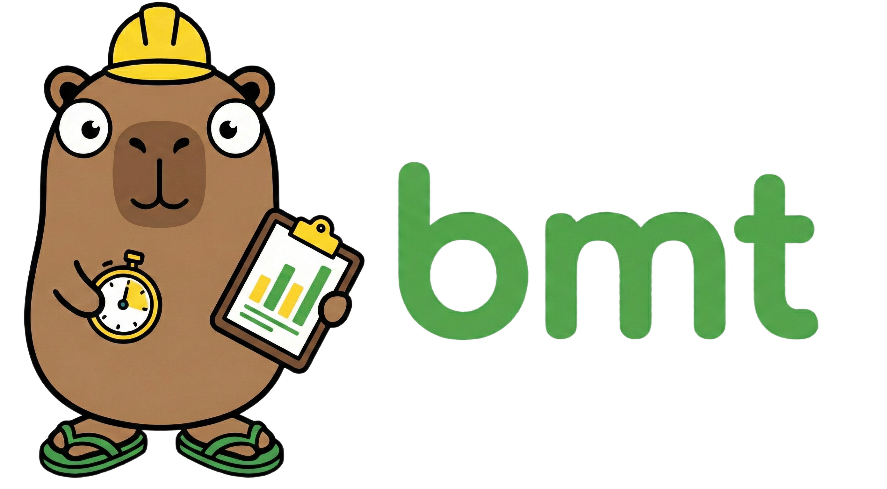

# BMT - Build Metric Tool 
<div align="left">
  
  
  
  
  <a href="https://app.codecov.io/github/Pedro-Magalhaes/dev-metrics"></a>
  <a href="https://github.com/Pedro-Magalhaes/dev-metrics/releases"></a>
</div>

<br/>

O **BMT** é uma ferramenta unificada escrita em Go, projetada para **medir a duração de comandos** (como builds de C++, testes ou lints), armazenar essas métricas localmente em formato **JSON Lines** (`.jsonl`) e gerar relatórios de produtividade.

Diferente de ferramentas complexas de CI, o BMT foca no desenvolvedor, permitindo entender quanto tempo você gasta "esperando o código compilar" no seu dia a dia.

---

## ⚡ Quickstart

### 1. Compilar o binário unificado:

```bash
make build

```

### 2. Medir um comando:

O uso do `--` garante que as flags do seu comando não se misturem com as do BMT.

```bash
./dist/bmt run -- go test ./...

```

### 3. Ver o relatório semanal agrupado por projeto:

```bash
./dist/bmt report

```

Você pode escolher a unidade dos totais:

```bash
./dist/bmt report --unit h
./dist/bmt report --unit min
./dist/bmt report --unit auto

```

---

## 🛠️ Instalação (Linux)

O BMT é distribuído como um binário único, facilitando a gestão.

### Opção A: Via Script de Instalação (Recomendado)

Instala a versão mais recente em `~/.local/bin` automaticamente:

```bash
curl -fsSL https://raw.githubusercontent.com/Pedro-Magalhaes/dev-metrics/main/scripts/install.sh | sh

```

Para instalar em um diretório personalizado, defina a variável BIN_DIR:
```bash
BIN_DIR=/caminho/customizado/bin curl -fsSL https://raw.githubusercontent.com/Pedro-Magalhaes/dev-metrics/main/scripts/install.sh | sh

```

### Opção B: Compilação Local

Se você tem o ambiente Go configurado (1.25+):

```bash
make install

```

*Isso copiará o binário para `~/.local/bin`.*

Também é possível passar um caminho customizado para a instalação do binário:

```
make install BIN_DIR=/caminho/customizado/bin


```

---

## 📖 Subcomandos

O BMT utiliza uma estrutura de subcomandos intuitiva:

| Comando | Descrição |
| --- | --- |
| **`run`** | Executa um comando e registra a duração no log. |
| **`report`** | Analisa o log e exibe estatísticas semanais por projeto. |
| **`export`** | Converte os logs JSONL para CSV. |
| **`info`** | Exibe versão, commit, build date e o log em uso. |

---

## ⚙️ Configuração e Prioridade

O caminho do arquivo de log é resolvido na seguinte ordem de prioridade:

1. **Flag**: `bmt run --log /path/to/log.jsonl -- ...`
2. **Ambiente**: Variável `BUILD_METRICS_LOG`
3. **Padrão**: `~/.local/share/build-metrics/build_log.jsonl`

> **Dica:** Use `bmt info` para verificar qual arquivo de log está sendo lido no momento.

---

## 📊 Estrutura de Dados (Schema)

### Campos registrados (schema)

O objeto gravado segue :


Cada execução gera um objeto JSON com os seguintes campos definido no struct `metrics.BuildMetric` :

- `timestamp`: Data/hora da execução (RFC3339).
- `user`: Usuário linux que executou o comando
- `hostname`: hostname da máquina atual
- `os` (ex.: `linux`, `darwin`, `windows`)
- `project`: Nome da pasta raiz do projeto Git ou `"unknown"`
- `branch`: Branch atual no momento da execução ou `"unknown"`
- `commit` hash curto do commit do momento da execução ou `"unknown"`
- `duration_sec`: Tempo total de execução em segundos.
- `returncode`: Código retornado pelo comando executado
- `cpus`: Número de cpus da máquina
- `status`: `success`, `failure` baseado no exit code ou `interrupted`.
- `command`: O comando exato que foi executado.

---

## 🏗️ Estrutura do Projeto

A aplicação utiliza um **Padrão de Registro Dinâmico**, facilitando a adição de novos comandos sem alterar o núcleo do sistema:

* `cmd/bmt/main.go`: Ponto de entrada e roteador de subcomandos.
* `internal/commands/`: Implementação de cada subcomando (`run.go`, `report.go`, etc.).
* `internal/metrics/`: Lógica de persistência, modelos e configurações.
* `internal/git/`: Utilitários para extração de contexto do repositório.

---

Essa é uma excelente ideia. Adicionar exemplos práticos no `README.md` transforma a ferramenta de "apenas um binário" em uma **solução de fluxo de trabalho**. O objetivo aqui é mostrar como o `bmt` pode ser "invisível" no dia a dia, coletando dados sem que o desenvolvedor precise se lembrar de executá-lo.

Aqui está a nova seção de **Exemplos de Uso Avançado** para você copiar e colar no final do seu arquivo:

---

## 🚀 Exemplos de Uso Avançados by 🤖

Abaixo estão algumas formas de integrar o `bmt` profundamente no seu workflow para extrair o máximo de valor dos seus dados.

### 1. "Invisibilidade": Aliases Automáticos

Em vez de digitar `bmt run --` todas as vezes, você pode criar um alias no seu `~/.zshrc` ou `~/.bashrc` para que comandos pesados sejam medidos automaticamente.

```bash
# Medir automaticamente qualquer execução de 'make'
alias make='bmt run -- make'

# Medir builds de CMake
alias cbuild='bmt run -- cmake --build build'

# Medir instalação de dependências
alias npm-install='bmt run -- npm install'

```

*Agora, toda vez que você rodar `make`, o BMT registrará a duração silenciosamente no fundo.*

### 2. Integração com `jq` para Consultas Customizadas

Como o BMT armazena dados em JSONL, você pode usar o [jq](https://jqlang.github.io/jq/) para fazer perguntas complexas aos seus logs:

**Qual foi o build mais longo do último mês?**

```bash
cat ~/.local/share/build-metrics/build_log.jsonl | jq -s 'sort_by(.duration_sec) | last'

```

**Quanto tempo total (em minutos) eu gastei em builds hoje?**

```bash
cat build_log.jsonl | jq -r 'select(.timestamp | startswith("2024-05-20")) | .duration_sec' | awk '{s+=$1} END {print s/60 " min"}'

```

### 3. Workflow de Integração Contínua (CI)

Você pode usar o BMT no seu CI para monitorar se novos commits estão deixando o build mais lento em comparação com a média dos desenvolvedores:

```yaml
- name: Measure Build in CI
  run: |
    bmt run --log ci_stats.jsonl -- make build
    # Opcional: Enviar ci_stats.jsonl para um dashboard central

```

### 4. Análise Visual via CSV

Se você prefere gráficos, pode exportar os dados e abri-los diretamente no Excel, Google Sheets ou até no Python (Pandas):

```bash
bmt export -out metrics.csv
# No Linux, você pode abrir direto (se tiver o LibreOffice instalado):
libreoffice --calc metrics.csv

```

---

### 💡 Dica de Ouro: Notificação após builds longos

Você pode combinar o BMT com notificações do sistema para ser avisado quando um build demorado finalmente terminar:

```bash
alias slow-build='bmt run -- make build && notify-send "Build Finalizado" "O processo levou $(bmt report | tail -n 1 | awk "{print \$NF}") segundos"'

```

---

## 👨‍💻 Desenvolvimento

Para contribuir ou realizar modificações:

```bash
# Formatar código
gofmt -w .

# Rodar verificações
go vet ./...

# Rodar testes
go test ./...

# Gerar build com metadados de versão
make build

```

### Links úteis

- Effective Go: https://go.dev/doc/effective_go
- Go Code Review Comments: https://github.com/golang/go/wiki/CodeReviewComments
- Go Blog: https://go.dev/blog/
- `gofmt`: https://pkg.go.dev/cmd/gofmt
- `go vet`: https://pkg.go.dev/cmd/vet
- Go Modules Reference: https://go.dev/ref/mod
